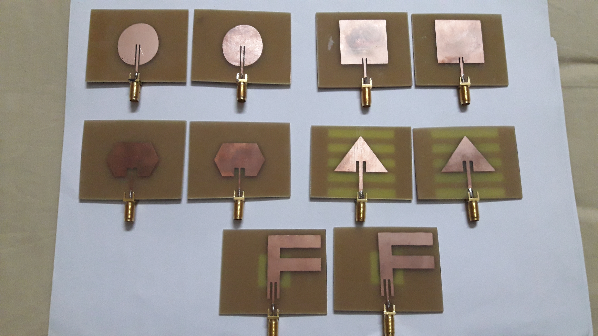
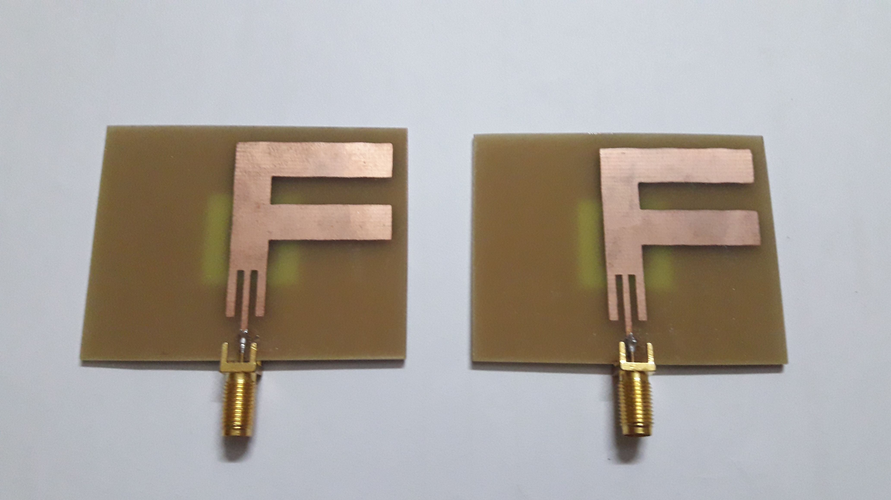
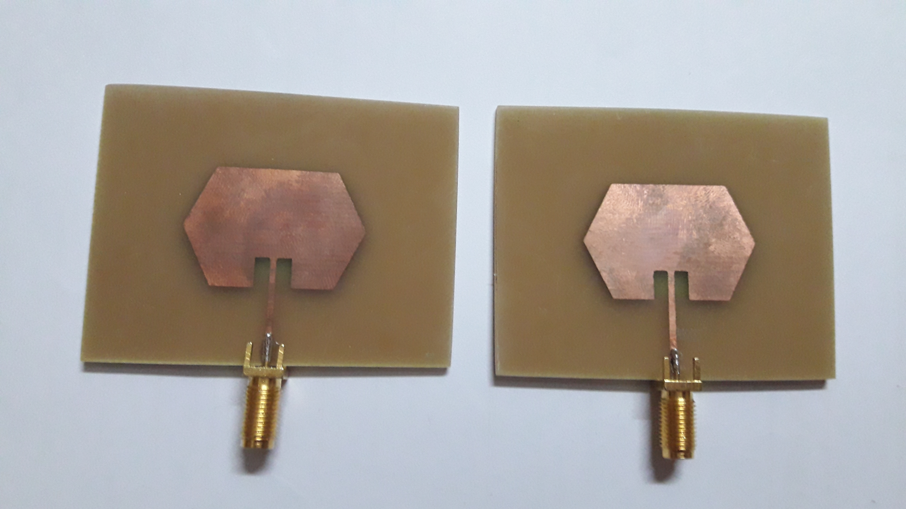
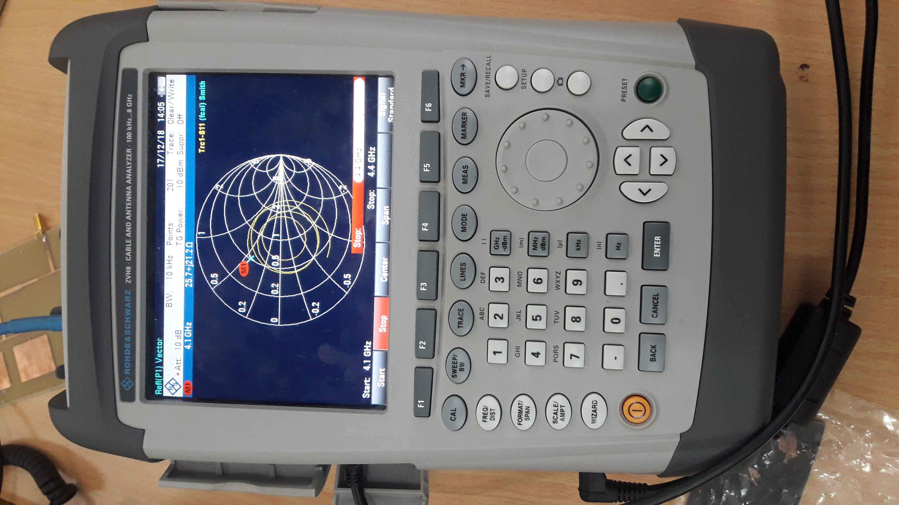
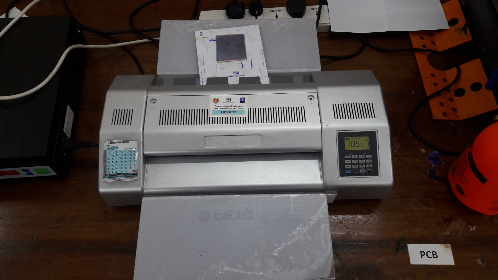
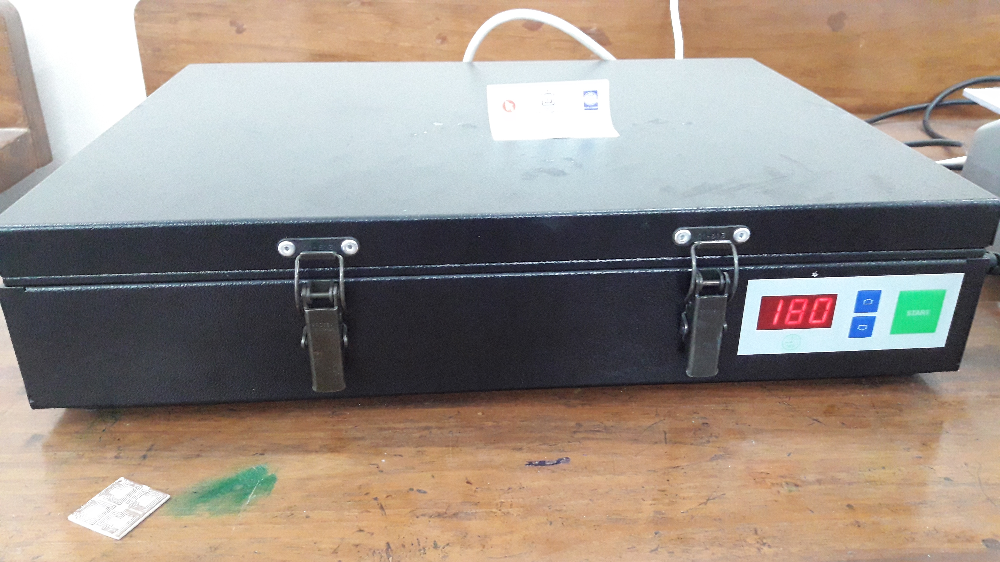
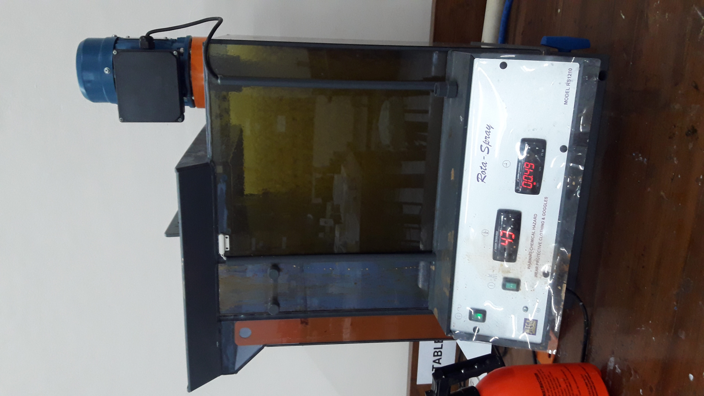
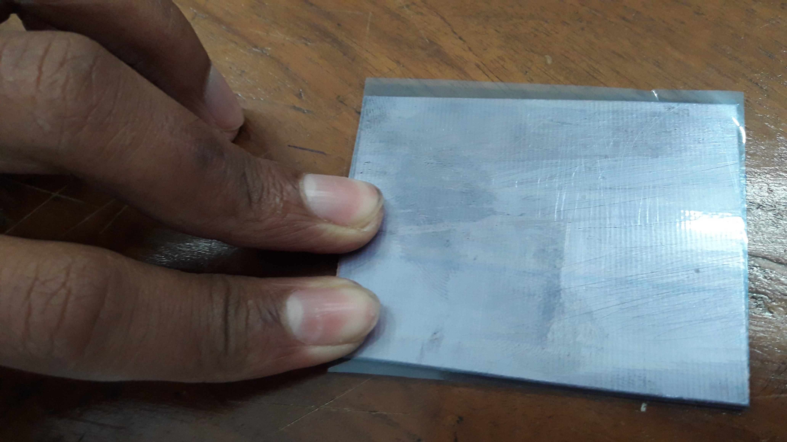
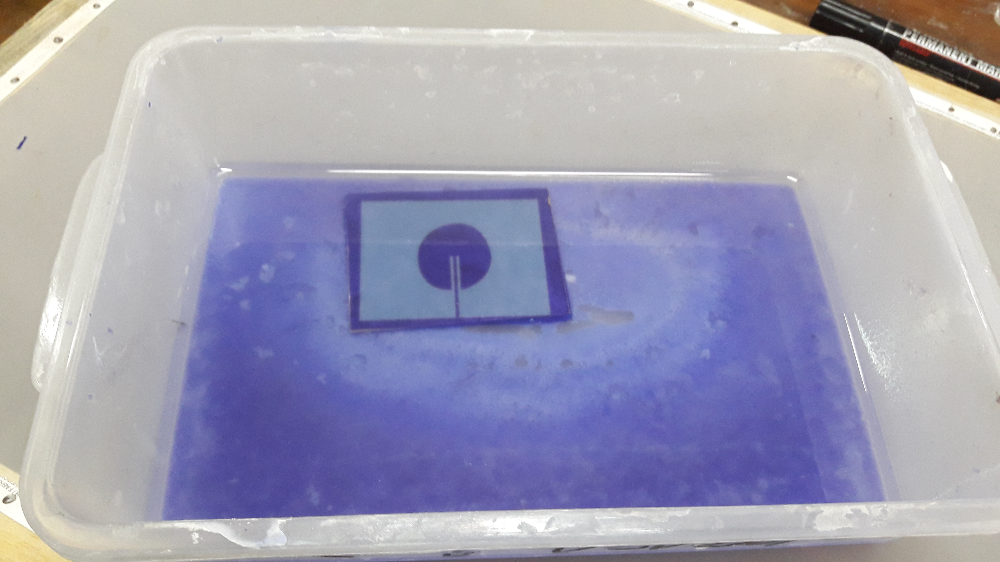

# Microstrip Patch Antenna — 2.45 GHz Geometry Comparison

[](https://creativecommons.org/licenses/by/4.0/)

Comparative study of five microstrip patch antenna geometries (circular, F-shaped, triangular, square, hexagonal) operating at 2.45 GHz. Each design was simulated in CST Studio Suite, fabricated on FR-4 substrate, and measured with a Rohde & Schwarz VNA.



## Results

### Simulation (CST Studio)

All five geometries were modeled in CST Studio Suite before fabrication. Each antenna was simulated at 2.45 GHz to evaluate return loss, impedance matching, bandwidth, and radiation characteristics. The 3D models, S11 plots, VSWR curves, radiation patterns, and far-field views are available in [`simulation-and-results.pdf`](docs/simulation-and-results.pdf). The CST VBA macros that build each antenna from scratch are in the [`cst/`](cst/) directory.

| Geometry       | S11 (dB)   | VSWR      | Bandwidth (%) | Gain (dBi) | Side Lobe (dB) |
|----------------|------------|-----------|---------------|------------|-----------------|
| **Circular**   | **−53.08** | **1.004** | **3.12**      | **5.54**   | **−3.7**        |
| F-shaped       | −30.02     | 1.065     | 2.98          | 4.11       | −1.6            |
| Triangular     | −18.86     | 1.257     | 2.45          | 4.51       | −0.6            |
| Square         | −16.38     | 1.357     | 2.41          | 3.00       | −6.7            |
| Hexagonal      | −14.78     | 1.446     | 2.12          | 5.54       | −7.0            |

### Measurement (VNA)

| Geometry       | S11 (dB)   | VSWR      |
|----------------|------------|-----------|
| **Circular**   | **−31.99** | **1.125** |
| F-shaped       | −16.98     | 1.167     |
| Triangular     | −15.37     | 1.368     |
| Square         | −14.46     | 1.536     |
| Hexagonal      | −13.93     | 1.694     |

### Simulation vs. Measurement

| Geometry   | S11 sim (dB) | S11 meas (dB) | ΔS11 (dB) | VSWR sim | VSWR meas | ΔVSWR |
|------------|-------------|--------------|-----------|----------|-----------|-------|
| Circular   | −53.08      | −31.99       | +21.09    | 1.004    | 1.125     | +0.121 |
| F-shaped   | −30.02      | −16.98       | +13.04    | 1.065    | 1.167     | +0.102 |
| Triangular | −18.86      | −15.37       | +3.49     | 1.257    | 1.368     | +0.111 |
| Square     | −16.38      | −14.46       | +1.92     | 1.357    | 1.536     | +0.179 |
| Hexagonal  | −14.78      | −13.93       | +0.85     | 1.446    | 1.694     | +0.248 |

Circular patch came out on top in both simulation and measurement. All five designs cleared the S11 < −10 dB threshold, confirming acceptable impedance matching at 2.45 GHz. The ranking held across simulation and measurement, though measured return loss was consistently higher (worse) than simulated. The largest delta appeared in the circular patch (21 dB), likely because its deep simulated null is sensitive to any real-world imperfection. Probable error sources include SMA connector parasitics, FR-4 permittivity variation (manufacturer spec: 4.2–4.8, simulation used 4.4), etching undercut reducing trace accuracy, and soldering losses at the SMA–feed junction.

## Fabricated Antennas

Each geometry was fabricated on FR-4 with SMA connectors — two samples per design.

| Circular (best performer) | F-shaped | Triangular |
|:---:|:---:|:---:|
|  |  |  |
| **Square** | **Hexagonal** | |
|  |  | |

## Design Parameters

### Common

| Parameter              | Value              |
|------------------------|--------------------|
| Operating frequency    | 2.45 GHz           |
| Substrate              | FR-4 (εr ≈ 4.4)   |
| Substrate height (Hs)  | 1.4 mm             |
| Conductor height (Ht)  | 0.036 mm           |
| Ground plane (Wg × Lg) | 75.20 × 58.76 mm  |
| Feed line width (Fw)   | 2.7 mm             |
| Feed-patch gap (Gpf)   | 1 mm               |

### Geometry-Specific

| Geometry   | Dimensions |
|------------|------------|
| Circular   | R = 17.0 mm |
| Square     | S = 29.38 mm |
| Triangular | Tb = 37.60 mm, Th = 29.38 mm |
| Hexagonal  | Ha = 17.0 mm |
| F-shaped   | W = 37.60, L = 29.38, Vw = 10.0, Bh = 8.0, Sh = 3.0, Mw = 25.0 mm |

## Methodology

1. **Design** — Calculated patch dimensions for 2.45 GHz based on substrate properties
2. **Simulation** — Electromagnetic modeling in CST Studio Suite
3. **Fabrication** — PCB manufacturing via photolithography, UV exposure, and chemical etching
4. **Measurement** — S-parameter characterization using a Rohde & Schwarz VNA
5. **Comparison** — Analyzed return loss, bandwidth, and radiation patterns across all five geometries

### Equipment Used

| VNA (Smith chart display) | Laminator | UV Exposure Unit |
|:---:|:---:|:---:|
|  |  |  |

| UV Exposure (closed) | Etching Machine |
|:---:|:---:|
|  |  |

### Fabrication Process

| Blank FR-4 substrate | Circular patch in NaOH developer bath |
|:---:|:---:|
|  |  |

## Simulation Macros

CST Studio VBA macros for each geometry — open in CST and run to build the full antenna model (substrate, ground plane, patch, feed line, port, and solver).

| Macro | Patch shape |
|-------|-------------|
| [`circular-patch.bas`](cst/circular-patch.bas) | Cylinder — R = 17.0 mm |
| [`square-patch.bas`](cst/square-patch.bas) | Brick — S = 29.38 mm |
| [`triangular-patch.bas`](cst/triangular-patch.bas) | Extruded isosceles triangle — base 37.60 mm, height 29.38 mm |
| [`hexagonal-patch.bas`](cst/hexagonal-patch.bas) | Extruded regular hexagon — side 17.0 mm |
| [`f-shaped-patch.bas`](cst/f-shaped-patch.bas) | Boolean union of vertical bar + two horizontal bars |

## Documentation

| Document | Contents |
|----------|----------|
| [`methodology.pdf`](docs/methodology.pdf) | Design parameters, substrate specs, VNA calibration |
| [`simulation-and-results.pdf`](docs/simulation-and-results.pdf) | CST results — S11 plots, VSWR, radiation patterns, gain |
| [`fabrication-and-measurement.pdf`](docs/fabrication-and-measurement.pdf) | Step-by-step fabrication process, VNA measurements |

## Repository Structure

```
Antenna/
├── README.md
├── LICENSE
├── CITATION.cff
├── .gitignore
├── .gitattributes
├── cst/
│   ├── circular-patch.bas
│   ├── square-patch.bas
│   ├── triangular-patch.bas
│   ├── hexagonal-patch.bas
│   └── f-shaped-patch.bas
├── docs/
│   ├── methodology.pdf
│   ├── simulation-and-results.pdf
│   └── fabrication-and-measurement.pdf
└── images/
    ├── equipment/
    │   ├── vna-smith-chart.jpg
    │   ├── laminator.jpg
    │   ├── uv-exposure-open.jpg
    │   ├── uv-exposure-closed.jpg
    │   └── etching-machine.jpg
    ├── fabrication/
    │   ├── fr4-substrate-blank.jpg
    │   └── circular-patch-naoh-bath.jpg
    └── antennas/
        ├── circular-patch.jpg
        ├── f-shaped-patch.jpg
        ├── triangular-patch.jpg
        ├── square-patch.jpg
        ├── hexagonal-patch.jpg
        └── all-five-geometries.jpg
```

## Applications

2.45 GHz microstrip patch antennas are used in Bluetooth, Wi-Fi (802.11b/g/n), ZigBee, and satellite communication systems. This study shows that patch geometry alone can noticeably improve antenna performance without increasing design complexity.

## Tools

CST Studio Suite · Rohde & Schwarz VNA · FR-4 Substrate · CorelDraw

## Citing This Work

GitHub provides a "Cite this repository" button via the [`CITATION.cff`](CITATION.cff) file. You can also use this BibTeX entry directly:

```bibtex
@misc{bose2018microstrip,
  author       = {Bose, Urme},
  title        = {Microstrip Patch Antenna: 2.45 GHz Geometry Comparison},
  year         = {2018},
  url          = {https://github.com/urme-b/Antenna},
  note         = {Comparative study of circular, F-shaped, triangular, square, and hexagonal patch geometries on FR-4 substrate}
}
```

## References

1. C. A. Balanis, *Antenna Theory: Analysis and Design*, 4th ed. Hoboken, NJ: Wiley, 2016. — Chapters 14.2–14.4 cover the transmission-line model and cavity model used to derive rectangular and circular patch dimensions.
2. R. Garg, P. Bhartia, I. Bahl, and A. Ittipiboon, *Microstrip Antenna Design Handbook*. Norwood, MA: Artech House, 2001. — Design curves and impedance matching techniques for various patch geometries.
3. D. M. Pozar, "Microstrip Antennas," *Proc. IEEE*, vol. 80, no. 1, pp. 79–91, Jan. 1992. — Survey of microstrip antenna theory, design methods, and feeding techniques.
4. K. F. Lee and K. M. Luk, *Microstrip Patch Antennas*. London: Imperial College Press, 2011. — Geometry-specific analysis including triangular, circular, and polygonal patches.

## License

This project is licensed under [CC BY 4.0](LICENSE).
