# Microstrip Patch Antenna: 2.45 GHz Geometry Comparison

**Which patch shape performs best at 2.45 GHz — the ISM band behind Wi-Fi, Bluetooth, and ZigBee?** Five geometries — circular, F-shaped, triangular, square, hexagonal — designed, simulated in CST Studio Suite, fabricated on FR-4, measured on a Rohde & Schwarz VNA. **The circular patch wins in both simulation and measurement.**

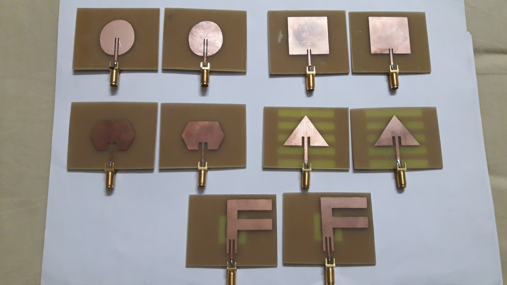

## Results

### Simulation (CST Studio Suite)

<!-- BEGIN:sim-table -->
<table>
<thead><tr><th>Geometry </th><th>S11 (dB) </th><th>VSWR </th><th>Bandwidth (%) </th><th>Main Lobe (dB) </th><th>Side Lobe (dB) </th></tr></thead>
<tbody>
<tr><td><strong>Circular</strong></td><td><strong>−53.08</strong></td><td><strong>1.004</strong></td><td><strong>3.12</strong></td><td><strong>5.54</strong></td><td><strong>−3.7</strong></td></tr>
<tr><td>F-shaped</td><td>−30.02</td><td>1.065</td><td>2.98</td><td>4.11</td><td>−1.6</td></tr>
<tr><td>Triangular</td><td>−18.86</td><td>1.257</td><td>2.45</td><td>4.51</td><td>−0.6</td></tr>
<tr><td>Square</td><td>−16.38</td><td>1.357</td><td>2.41</td><td>3.00</td><td>−6.7</td></tr>
<tr><td>Hexagonal</td><td>−14.78</td><td>1.446</td><td>2.12</td><td>5.54</td><td>−7.0</td></tr>
</tbody>
</table>
<!-- END:sim-table -->

> *Main Lobe (dB)* is CST's far-field main-lobe magnitude; circular and hexagonal genuinely tie at 5.54 dB.

### Measurement (VNA)

<!-- BEGIN:measurement-table -->
<table>
<thead><tr><th>Geometry </th><th>S11 (dB) </th><th>VSWR </th></tr></thead>
<tbody>
<tr><td><strong>Circular</strong></td><td><strong>−31.99</strong></td><td><strong>1.125</strong></td></tr>
<tr><td>F-shaped</td><td>−16.98</td><td>1.167</td></tr>
<tr><td>Triangular</td><td>−15.37</td><td>1.368</td></tr>
<tr><td>Square</td><td>−14.46</td><td>1.536</td></tr>
<tr><td>Hexagonal</td><td>−13.93</td><td>1.694</td></tr>
</tbody>
</table>
<!-- END:measurement-table -->

### Simulation vs. Measurement

<!-- BEGIN:delta-table -->
<table>
<thead><tr><th>Geometry </th><th>S11 sim (dB) </th><th>S11 meas (dB) </th><th>ΔS11 (dB) </th><th>VSWR sim </th><th>VSWR meas </th><th>ΔVSWR </th></tr></thead>
<tbody>
<tr><td>Circular</td><td>−53.08</td><td>−31.99</td><td>+21.09</td><td>1.004</td><td>1.125</td><td>+0.121</td></tr>
<tr><td>F-shaped</td><td>−30.02</td><td>−16.98</td><td>+13.04</td><td>1.065</td><td>1.167</td><td>+0.102</td></tr>
<tr><td>Triangular</td><td>−18.86</td><td>−15.37</td><td>+3.49</td><td>1.257</td><td>1.368</td><td>+0.111</td></tr>
<tr><td>Square</td><td>−16.38</td><td>−14.46</td><td>+1.92</td><td>1.357</td><td>1.536</td><td>+0.179</td></tr>
<tr><td>Hexagonal</td><td>−14.78</td><td>−13.93</td><td>+0.85</td><td>1.446</td><td>1.694</td><td>+0.248</td></tr>
</tbody>
</table>
<!-- END:delta-table -->

- Same ranking in both; all five clear S11 < −10 dB
- Circular sits closest to 2.45 GHz with the deepest null
- Deltas: SMA parasitics, FR-4 εr spread, etching, solder

### Figure of Merit

Different footprints, so normalise:

<!-- BEGIN:fom-table -->
<table>
<thead><tr><th>Geometry </th><th>Footprint (mm²) </th><th>Main Lobe (dB) </th><th>Gain ÷ area (cm⁻²) </th><th>Gain × BW </th></tr></thead>
<tbody>
<tr><td><strong>Circular</strong></td><td><strong>908</strong></td><td><strong>5.54</strong></td><td><strong>0.394</strong></td><td><strong>0.112</strong></td></tr>
<tr><td>F-shaped</td><td>635</td><td>4.11</td><td>0.406</td><td>0.077</td></tr>
<tr><td>Triangular</td><td>552</td><td>4.51</td><td>0.511</td><td>0.069</td></tr>
<tr><td>Square</td><td>863</td><td>3.00</td><td>0.231</td><td>0.048</td></tr>
<tr><td>Hexagonal</td><td>751</td><td>5.54</td><td>0.477</td><td>0.076</td></tr>
</tbody>
</table>
<!-- END:fom-table -->

- Link budget and bandwidth: **circular**. Tight board area: **triangular** or **hexagonal**.

## Fabricated Antennas

Two samples per design, photolithography on FR-4, SMA-fed:

| Circular (best performer) | F-shaped | Triangular |
|:---:|:---:|:---:|
| 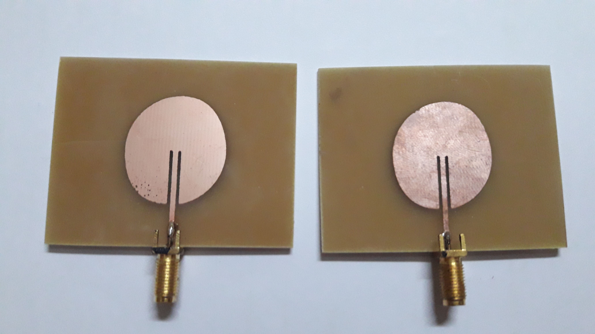 | 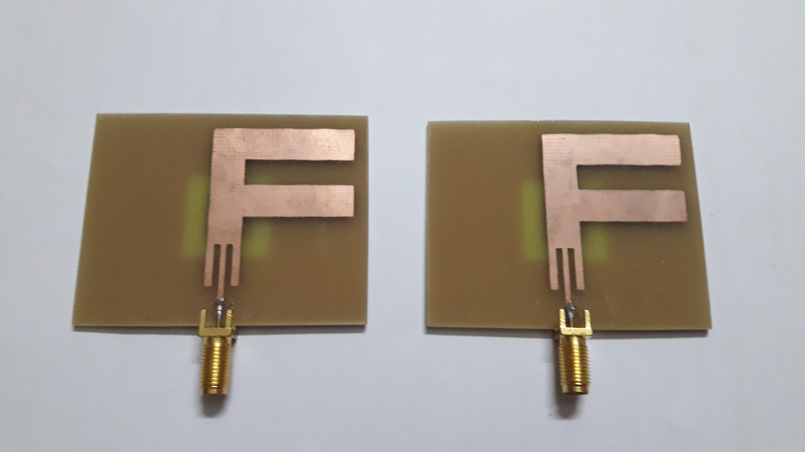 | 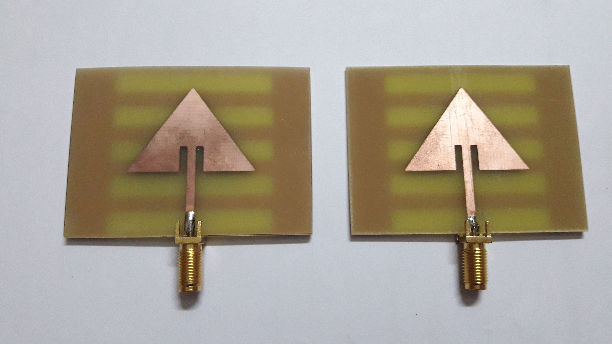 |
| **Square** | **Hexagonal** | |
| 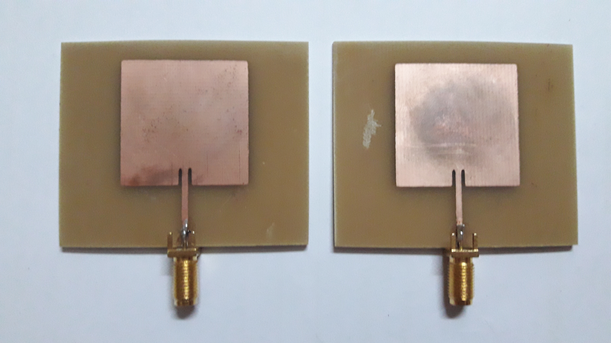 | 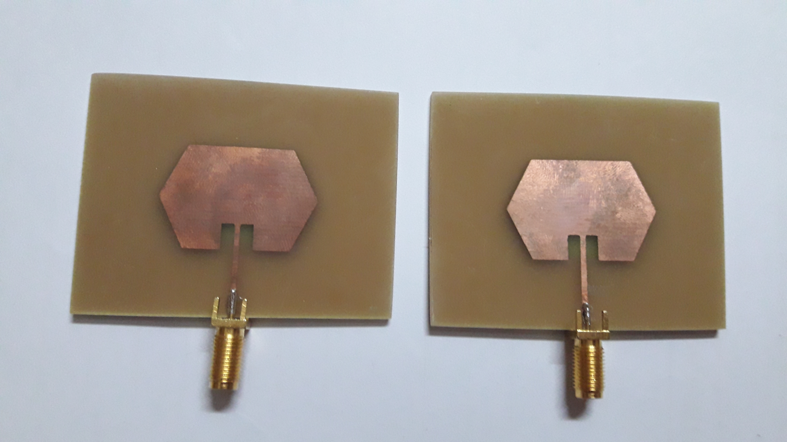 | |

## Design Parameters

### Common

<table>
<thead><tr><th>Parameter </th><th>Value </th></tr></thead>
<tbody>
<tr><td>Operating frequency</td><td>2.45 GHz</td></tr>
<tr><td>Substrate</td><td>FR-4 (εr ≈ 4.4, tan δ = 0.02)</td></tr>
<tr><td>Substrate height (Hs)</td><td>1.4 mm</td></tr>
<tr><td>Conductor height (Ht)</td><td>0.036 mm</td></tr>
<tr><td>Ground plane (Wg × Lg)</td><td>75.20 × 58.76 mm</td></tr>
<tr><td>Feed line width (Fw)</td><td>2.7 mm (50 Ω)</td></tr>
<tr><td>Feed-patch gap (Gpf)</td><td>1 mm</td></tr>
</tbody>
</table>

### Geometry-Specific

<table>
<thead><tr><th>Geometry </th><th>Dimensions </th></tr></thead>
<tbody>
<tr><td>Circular</td><td>R = 17.0 mm</td></tr>
<tr><td>Square</td><td>S = 29.38 mm</td></tr>
<tr><td>Triangular</td><td>Tb = 37.60 mm, Th = 29.38 mm</td></tr>
<tr><td>Hexagonal</td><td>Ha = 17.0 mm</td></tr>
<tr><td>F-shaped</td><td>W = 37.60, L = 29.38, Vw = 10.0, Bh = 8.0, Sh = 3.0, Mw = 25.0 mm</td></tr>
</tbody>
</table>

## Simulation

Set PatchShape in Main and run — [patch-antenna.bas](cst/patch-antenna.bas) builds substrate, ground plane, patch, feed, waveguide port, monitors, and solver from scratch.

<table>
<thead><tr><th>PatchShape </th><th>Patch construction </th></tr></thead>
<tbody>
<tr><td>"circular"</td><td>Cylinder, R = 17.0 mm</td></tr>
<tr><td>"square"</td><td>Brick, S = 29.38 mm</td></tr>
<tr><td>"triangular"</td><td>Extruded isosceles triangle, base 37.60 mm, height 29.38 mm</td></tr>
<tr><td>"hexagonal"</td><td>Extruded regular hexagon, side 17.0 mm</td></tr>
<tr><td>"fshaped"</td><td>Boolean union of vertical bar + two horizontal bars</td></tr>
</tbody>
</table>

- Annealed-copper conductors; Eps exposed for FR-4 tolerance sweeps
- Hex mesh, adaptive refinement, open boundaries, 6·Hs port
- Two feed expressions per shape: Ey (edge) and Fx (centre)
- Exports the solved sweep to s11.s1p for antenna ingest

## Fabrication and Measurement

Full process in [fabrication-and-measurement.pdf](docs/fabrication-and-measurement.pdf):

- CorelDraw mask → laminated photoresist FR-4 → ~2 min UV exposure → NaOH developer → chemical etch
- SMA soldered to the 50 Ω feed; S-parameters on a Rohde & Schwarz ZVH

| VNA (Smith chart) | Laminator | UV exposure unit |
|:---:|:---:|:---:|
| 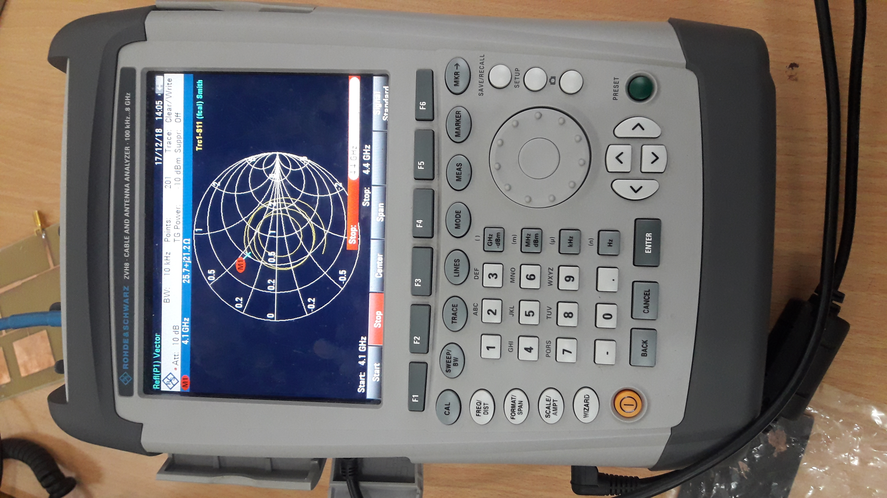 | 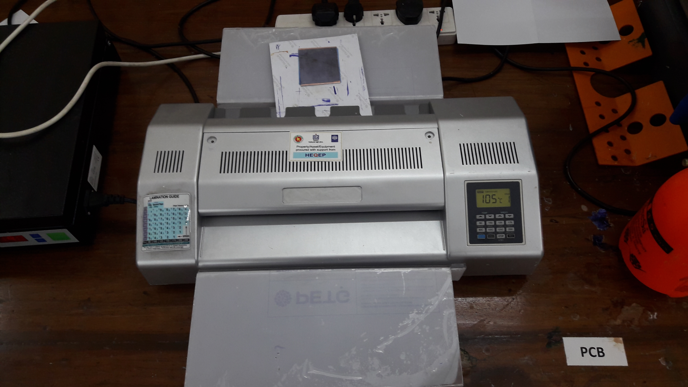 | 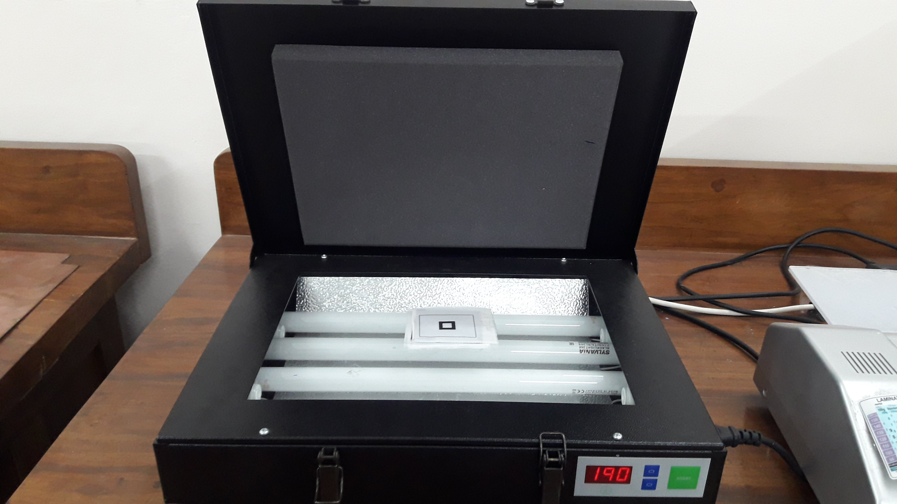 |

| UV exposure (closed) | Etching machine |
|:---:|:---:|
| 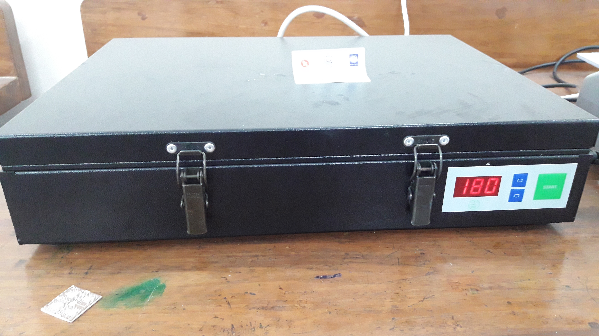 | 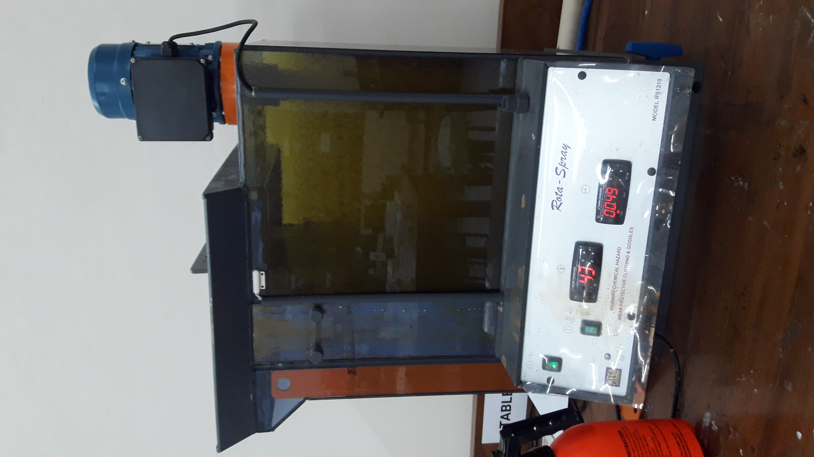 |

| Blank FR-4 substrate | Circular patch in NaOH developer bath |
|:---:|:---:|
| 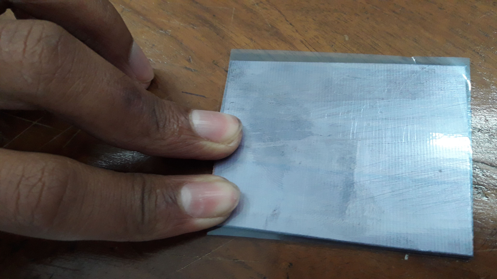 | 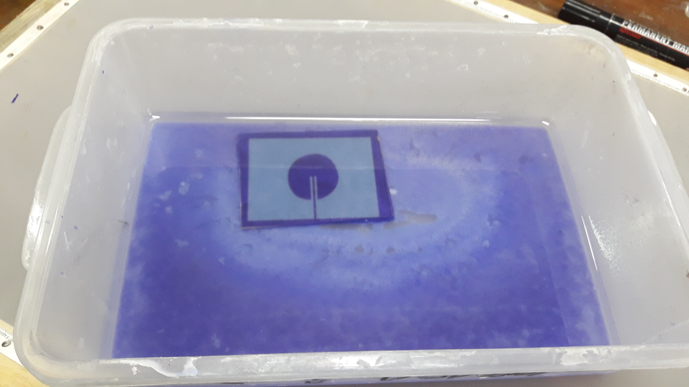 |

## Results

| Return loss: simulation vs measurement | CST S11 sweep: circular patch |
|:---:|:---:|
| 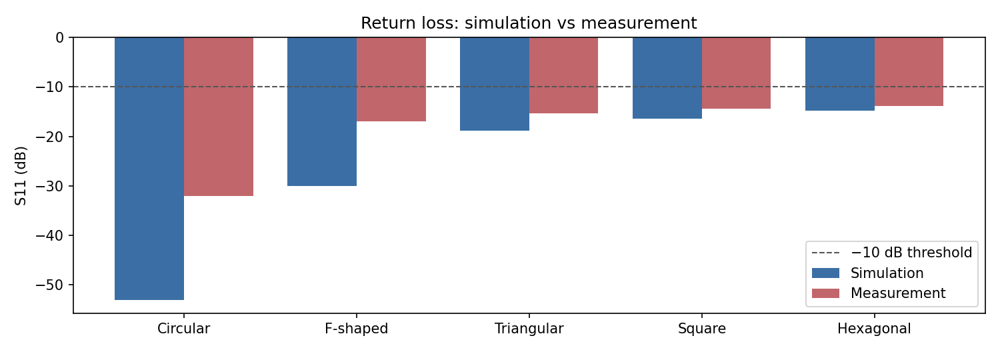 | 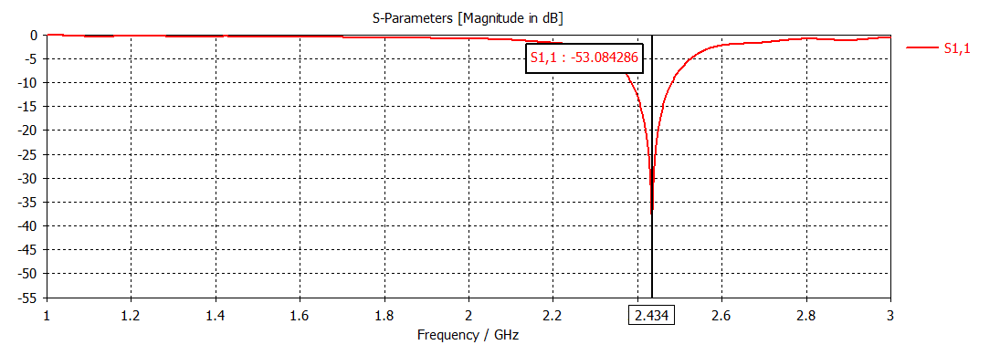 |

- Left: measured S11 tracks the simulated ranking, all five below −10 dB
- Right: the winner's simulated S11 — a −53.08 dB null at 2.434 GHz (Fig 4.2)
- Full CST outputs for all five shapes in [simulation-and-results.pdf](docs/simulation-and-results.pdf)

## Analysis Toolkit

Every number above is a computed view of [results.json](tools/antenna/data/results.json) — tables cannot drift from the data, or from each other.

<table>
<thead><tr><th>Module </th><th>What it does </th></tr></thead>
<tbody>
<tr><td>metrics.py</td><td>Exact S11, reflection coefficient, and VSWR identities; bandwidth from band edges</td></tr>
<tr><td>design.py</td><td>Shape-correct resonance equations (Balanis, Garg) and patch footprint areas</td></tr>
<tr><td>fom.py</td><td>Area-normalised gain and gain-bandwidth product</td></tr>
<tr><td>check.py</td><td>Physics validator wired into CI</td></tr>
<tr><td>tables.py</td><td>Renders and injects every README table between marker comments</td></tr>
<tr><td>touchstone.py</td><td>Minimal .s1p reader (DB, MA, RI) for VNA and CST sweeps</td></tr>
<tr><td>plots.py</td><td>Publication-ready charts from the canonical data</td></tr>
</tbody>
</table>

## Limitations

- Tables use the earlier PEC model; rerun the copper macro to refresh
- Measured pairs and three bandwidths disagree with their sweeps; single sample, CI-flagged
- Only the circular patch hits 2.45 GHz; antenna synth corrects the rest

## Applications

<table>
<thead><tr><th># </th><th>Application </th><th>Why 2.45 GHz patches fit </th></tr></thead>
<tbody>
<tr><td>1</td><td>Wi-Fi (802.11 b/g/n) access points and clients</td><td>Low profile, direct PCB integration</td></tr>
<tr><td>2</td><td>Bluetooth and BLE modules</td><td>Compact footprint on standard FR-4</td></tr>
<tr><td>3</td><td>ZigBee / IEEE 802.15.4 sensor networks</td><td>Cheap to mass-produce with node hardware</td></tr>
<tr><td>4</td><td>RFID readers (2.45 GHz ISM band)</td><td>Directional pattern suits gate and portal readers</td></tr>
<tr><td>5</td><td>Wireless medical telemetry</td><td>Conformal, lightweight, body-worn friendly</td></tr>
<tr><td>6</td><td>ISM-band industrial telemetry and microwave power transfer</td><td>Etchable, low cost, easily arrayed for higher gain</td></tr>
</tbody>
</table>

## Tech Stack

<table>
<thead><tr><th>Layer </th><th>Tool </th></tr></thead>
<tbody>
<tr><td>EM simulation</td><td>CST Studio Suite (VBA macro, time-domain solver)</td></tr>
<tr><td>Model scripting</td><td>CST VBA (<a href="cst/patch-antenna.bas">patch-antenna.bas</a>)</td></tr>
<tr><td>Analysis toolkit</td><td>Python 3.9+ (standard library core; matplotlib optional)</td></tr>
<tr><td>Testing</td><td>pytest (14 tests)</td></tr>
<tr><td>Mask design</td><td>CorelDraw</td></tr>
<tr><td>Fabrication</td><td>Photolithography: laminator, UV exposure, NaOH developer, chemical etching</td></tr>
<tr><td>Measurement</td><td>Rohde & Schwarz ZVH vector network analyzer</td></tr>
<tr><td>Substrate</td><td>FR-4, 1.4 mm, 0.036 mm copper</td></tr>
</tbody>
</table>

## Documentation

<table>
<thead><tr><th>Document </th><th>Contents </th></tr></thead>
<tbody>
<tr><td><a href="docs/methodology.pdf">methodology.pdf</a></td><td>Design parameters, substrate specs, VNA calibration</td></tr>
<tr><td><a href="docs/simulation-and-results.pdf">simulation-and-results.pdf</a></td><td>CST results: S11, VSWR, radiation patterns, gain</td></tr>
<tr><td><a href="docs/fabrication-and-measurement.pdf">fabrication-and-measurement.pdf</a></td><td>Step-by-step fabrication, VNA measurements</td></tr>
</tbody>
</table>

## References

1. C. A. Balanis, *Antenna Theory: Analysis and Design*, 4th ed. Hoboken, NJ: Wiley, 2016. Chapters 14.2-14.4: transmission-line and cavity models for rectangular and circular patches.
2. R. Garg, P. Bhartia, I. Bahl, and A. Ittipiboon, *Microstrip Antenna Design Handbook*. Norwood, MA: Artech House, 2001. Design curves and impedance matching for varied patch geometries.
3. D. M. Pozar, "Microstrip Antennas," *Proc. IEEE*, vol. 80, no. 1, pp. 79-91, Jan. 1992. Survey of microstrip theory, design methods, and feeding techniques.
4. K. F. Lee and K. M. Luk, *Microstrip Patch Antennas*. London: Imperial College Press, 2011. Geometry-specific analysis of triangular, circular, and polygonal patches.

## License

[MIT](LICENSE)
